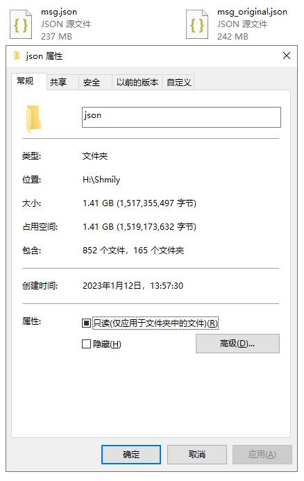

## Q&A

#### 为什么要做这个项目

> 大部分聊天记录导出的类似项目前端都非常简单, 甚至都是 html 模板直出, 一个 html 几百兆直接浏览器卡崩溃, 而且也没有搜索,评论等功能. 但对于存档项目来说, 搜索 筛选 等功能非常重要, 所以有了本项目.

#### 项目架构

> 为了降低难度, 毕竟大部分人不是程序员, 所以项目必须是纯静态项目, 避免繁琐的后端 runtime 依赖, 开箱即用.
>
> html 模板直出确实是最简单的部署方式, 可以直接双击打开. 但编码难度过高,无法承载如此复杂的项目, 而且 `file://` 的域限制让开发举步维艰.
>
> 最终采用 vue + 小型 webServer(webd) 的架构, 用 bat 脚本粘合启用, 也能做到开箱即用

#### 为什么生成的数据 json 这么大

> 因为是存档项目, 项目有以下特点
>
> -   数据量巨大
>
>     为了尽量降低机器配置需求, 让尽可能多的电脑能运行, 所以采用了 **空间换时间** 的策略, 提前静态化运算结果, 降低运行时的计算. 所以导致 `json` 数据庞大.
>
> -   本地使用
>
>     无需考虑网络带宽的承载
>     
>     (写代码时架构有考虑线上运行, 只需将 search 模块修改为 ajax , 无需全量下载, Server 端需要增加Api，按需返回结果即可 //暂无开发计划 ) 
>
> -   未来使用
>
>     考虑到计算机的发展, 这么点空间的浪费可以承受

#### 性能如何

> 大部分人认为前端 js 都很慢, 其实前端慢的是 DOM, 对于计算而言 js 并没有那么不堪.
>
> 项目经过精心优化, 其中也发现了很多有趣的案例 - [lodash some 方法性能为什么比 js 原生方法 还高？](https://v2ex.com/t/870035)
>
> 在 i5-7200u 8g 的笔记本下, 0.5s 间隔滚动一上午无内存溢出, 复杂搜索时间小于 0.3s. 各统计页面正常打开
 
| JSON | length |size|
| :-------------  | ------------:  | -------:  |
| msg.json       |  251534 条记录 |  240.0 MB   |
| comments.json  |   11023 条评论 |  10.8 MB  |
| 统计图表     |       -       |   956.00 MB  |
 

