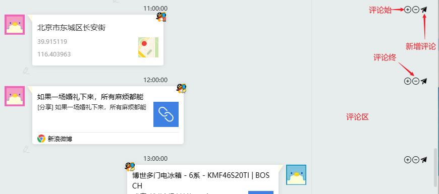
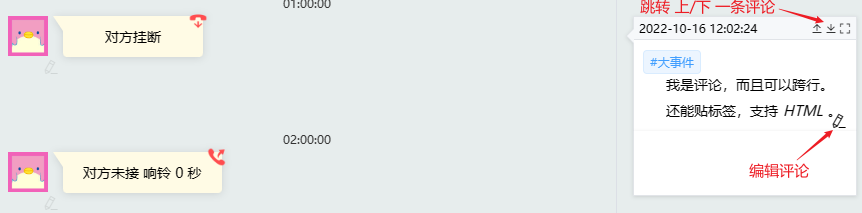
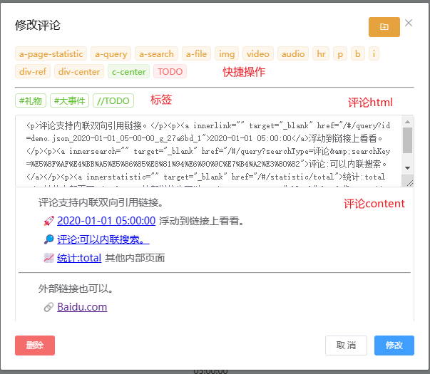
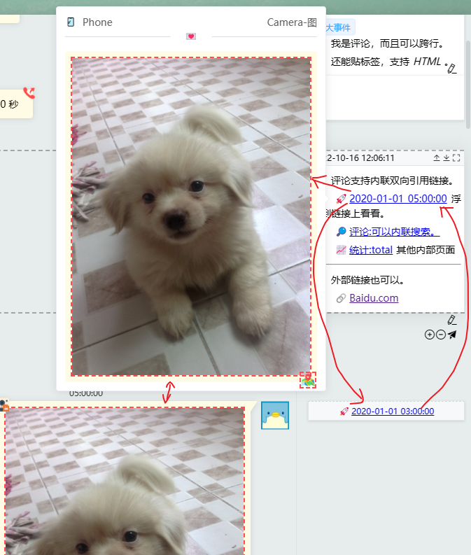
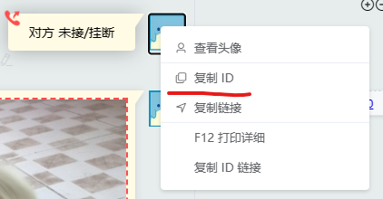
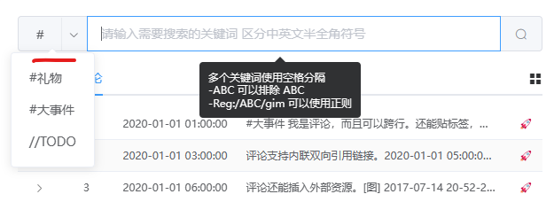

## 编辑评论

### 如何修改

每条消息的右边都有一条评论的空间

一条评论可以跨越多条消息, 可以通过 +- 按钮调整评论的起始位置, 但内容仅显示在第一条评论空间内, 其余空间显示空白

### 开始修改

评论分为快捷 `操作区`, `标签区`, `评论内容区(html,content)`

-   快捷操作
    一些快速添加 `评论html` 的脚本, 可以在 `memoryweb\src\components\Dev\Comment\components\rules\` 添加规则

    -   `内联链接` 特殊的 a 标签链接

        -   a-page-statistic 内联到统计页

            会根据路由模式对 url 进行特殊处理

        -   a-query 内联消息链接

            点击可新窗口跳转到具体消息 B, 并在 B 消息处创建 A 的双向链接, 浮动之上可预览对应消息内容
            

        -   a-search 内联查询链接

    -   添加评论资源

        评论资源路径在 `msgData\data\comments\$msg_id\***.jpg`

        > $msg_id 可以头像右键快速复制
        > 

        点击右上角 x 旁边图标可快速打开相应评论的资源文件夹

        点击以下快捷操作会自动创建 $msg_id 目录并打开文件夹, 将资源放置于文件夹后,输入文件名即可在光标位置快速插入资源 html

        -   a-file
        -   img
        -   video
        -   audio

-   标签

    可以在 `memoryweb\src\config.js` 中添加标签, 标签在搜索时可快速筛选
    

-   评论内容
    -   `html` 可手工编写
    -   `content` html 内容 预览
