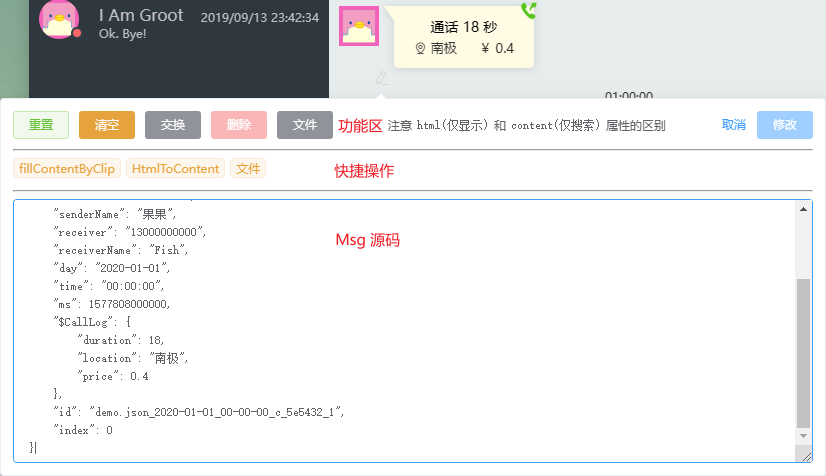

## 编辑消息

### 如何修改

鼠标移动到消息上后左下角会有 **编辑** 按钮, 如图

进行(多条) **删改** 后可点击左上角红色按钮确定修改. 或点击绿色按钮 F12 中查看

### 开始修改

修改窗口分为 `功能区`, `快捷操作`, `Msg 源码`

-   功能区

    一些基本操作按钮

    -   重置 取消 `Msg 源码` 的修改

    -   清空 清空 `Msg 源码`

    -   交换 交换收发件人

    -   删除 删除此条 `Msg`, 和在编辑按钮按 Ctrl 点击 效果一致

    -   文件

        上传文件并修改 `Msg`, 上传的文件会被放置到 `\msgData\data\$source\$type\manual\`

        -   图片
        -   视频
        -   语音
        -   表情(如 QQ-PC)

            会上传文件计算 MD5, 查询 `\msgData\data\qq-pc\face\emojiMapByQQ.json` 中是否已存在表情

            -   存在

                -   自动填充表情包名称(Package)和描述信息(alt)

            -   不存在
                -   手动填充表情包名称(Package)和描述信息(alt)
                    -   自动上传 `\msgData\data\qq-pc\face\$Package\$MD5.gif`
                    -   自动修改 `\msgData\data\qq-pc\face\$Package\_faceArr.json`
                    -   自动执行 `\msgData\data\qq-pc\face\$Package\merger.js` 生成新的 `emojiMapByQQ.json`

-   快捷操作

    一些快速修改 `Msg 源码` 的脚本, 会根据不同 `source` 变化, 可以在 `memoryweb\src\components\Dev\Msg\components\rules\` 添加规则

-   Msg 源码

    Msg 预览
