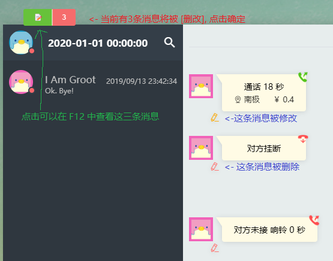

# 修改消息

## 进入编辑模式

    - 进入 `memoryweb` 执行 `npm run dev`
    - 进入 `server` 执行 `npm run start`
    - 打开 `msgData/tools/webServer/webd.exe` 资源web服务器

## 编辑消息

-   如何修改

        鼠标移动到消息上后左下角会有 **编辑** 按钮, 如图
        
        进行(多条) **删改** 后可点击左上角红色按钮确定修改. 或点击绿色按钮 F12 中查看
        

-   开始修改

        修改窗口分为 `功能区`, `快捷操作`, `Msg 源码`
        

    -   功能区
    -   快捷操作

            提前写好的一些常用快速修改脚本, 会根据不同 `source` 变化, 可以在 `memoryweb\src\components\Dev\Msg\components\rules\` 添加规则
